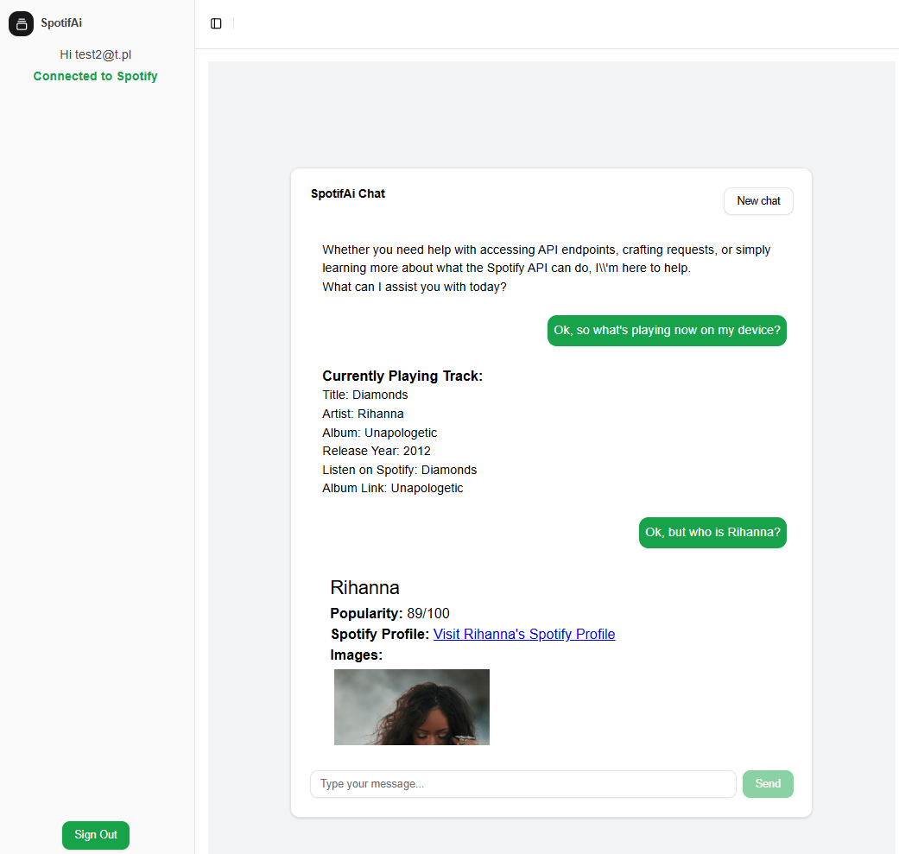
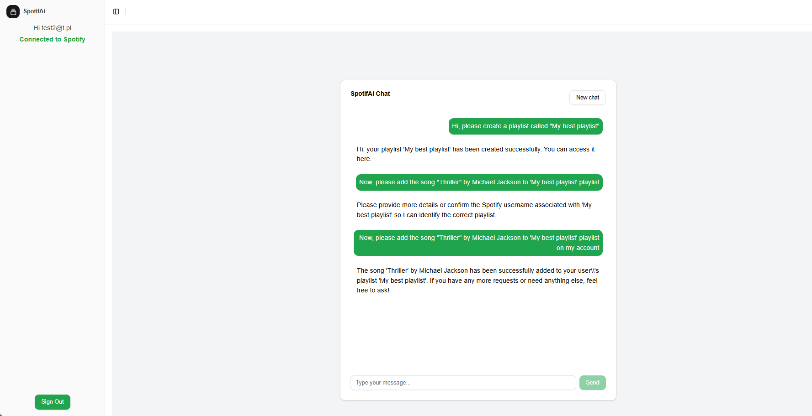

# Short description
In short, the core of the project is an AI agent who can reason, pick tools and use its knowledge to respond to user query.
The agent can read Spotify documentation, plan the sqeuence of endpoints to use, generate parameters and correct itself when an error occurs.
The result is a program which can use Spotify Api endpoints without hard-coding any logic other than authorization.

# What characterizes the project
The project may not seem like much, but it is a proof of concept of a new way of integrating with external APIs.
Normally each endpoint and use case would be hard-coded, but in this project the agent can reason and plan its actions.

## In the end (except for authorization) the whole integration app - spotify is just a switch statement for a HTTP method.
All urls, parameters and workflows are generated by the agent.
It just needs reference to the documentation and it can generate the correct sequence of endpoints to use.
It can also correct itself and retry sequence of requests with changed parameters if an error occurs.

# Real use case
For now the app is just a proof of concept. It proves that an AI agent can be used to interact with external APIs and it can construct the correct sequence of requests to achieve a goal.
The reliability of the agent is not perfect, but it correctly handles most easy to semi-intermediate sequences of requests.

# Demo of the app
User can interact with AI as in any chatbot. The agent will ask for user input and respond with the result of the query.

 This case involved a few more steps, but the agent was able to handle it. 
It had to create a playlist, find its id, find the artist and the song and add it to a playlist.
It took a few tries, but the agent was able to correct itself and complete the task.

